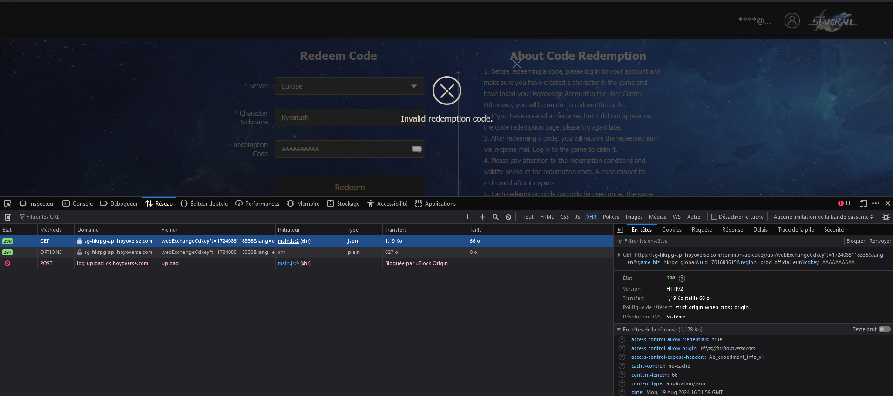
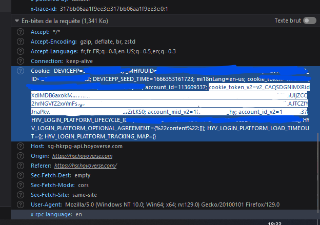
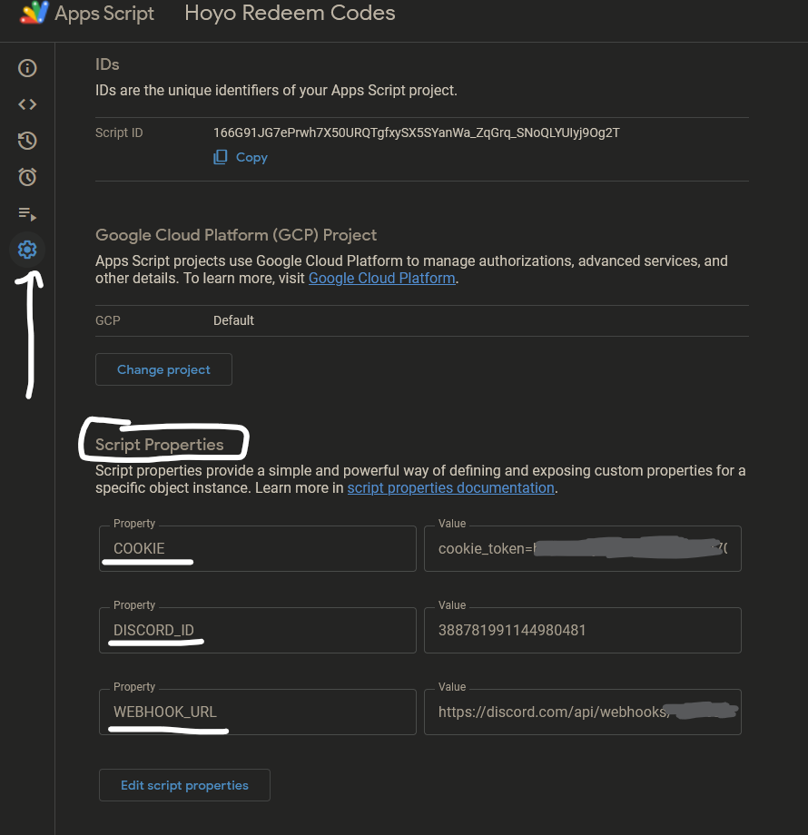
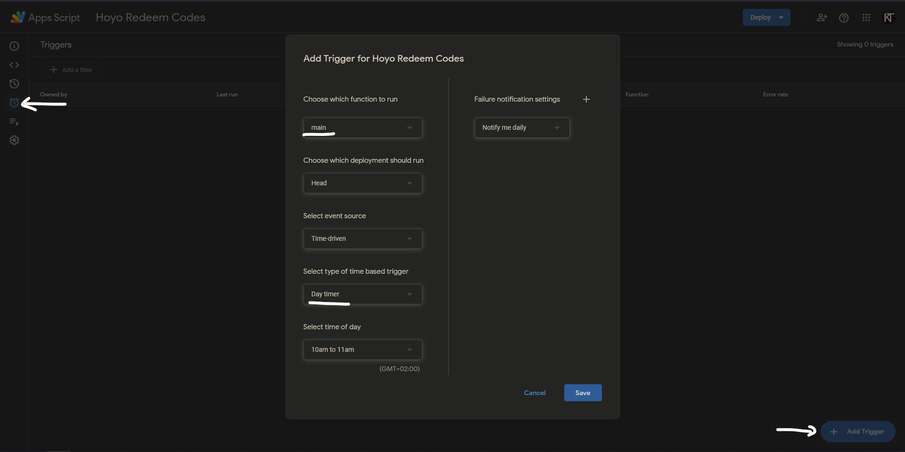

# Redeem Hoyo Codes Automatically

Don't want to miss out on free stuff but too lazy to do it by hand? This is what this script helps to solve. Works for Genshin, Honkai: Star Rail, and Zenless Zone Zero.

## Google Apps Script

1. Create a [Google Apps Script](https://script.google.com) and copy the code from [Code.gs](Code.gs) into it. Then for each account and game do steps 2 to 7 to setup your account info.

2. Open a redeem code page in your browser.
3. Login to your account.
4. Open the developer menu by hitting F12 and go to the network tab.
5. Enter anything in the code and click the button. A request should appear.
6. Click on the GET/POST webExchangeCdkey request. If you don't have a game, put the url blank in the Google Apps Script: it should look like this `''`. FOR EVERYTHING EXCEPT HSR: copy over to the right game URL in the script the `region`, `game_biz` and `uid` parameters. -- or directly copy the URL and you'll replace that, at your own risk if there are more parameters (it needs lang set to work too).
 FOR HSR: Go in the `Request` Subtab, and copy the values of `game_biz`, `uid` and `region` over to the script. \\
7. Then, scroll down into the Request Headers section and copy the part of the cookie that includes `cookie_token_v2`, `account_mid_v2` and `account_id_v2`.

8. In the Google apps script, on the left sidebar go into "Project Settings", and in the bottom add/edit a property named `COOKIE` and paste what you just copied in and click save. If you have multiple accounts, you can save different cookies by providing a property per account you are using. For example if you named your profiles "main" and "2nd", you can provide the properties "COOKIE_main" and "COOKIE_2nd" to have the script use these for the configured profile.
9. Set `DISCORD_ID` and `WEBHOOK_URL` properties also, so that it notifies you when it uses a new code or when you need to copy a new cookie. If you don't want to be pinged, leave `DISCORD_ID` blank.

## Running:
First, run it by choosing `first_main` in the top bar and running. Then, you will to set a trigger for it to run periodically.

In the left sidebar, go to "Triggers", then click "Add Trigger". The function to run should be `main`, and I recommend to make the source `Time-driven`, triggering at `Day timer` and a random time of day. Then click save and it's finished.

### NEVER CLICK LOG OUT ON HOYOVERSE WEBSITE.
### If it ever says you are not logged in, just repeat steps 5 to 8.

If you have problems, I am available for help in on discord `@Kynatosh` on the Stardb Discord Server: https://discord.gg/chives.

## Acknowledgements
* https://github.com/canaria3406/hoyolab-auto-sign for inspiration
* @Minigamer42 on the [StarDB Discord Server](https://discord.gg/chives) for the idea
